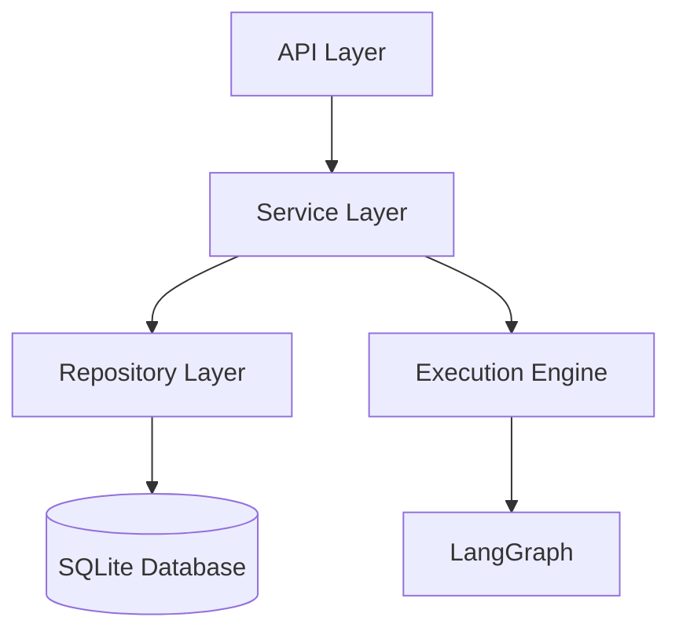

# Agentic Platform Backend

The core execution engine and API service for the Agentic Platform. Built with **FastAPI**, **LangGraph**, and **SQLDoctor**.

## 🏗 Architecture

The backend follows a layered architecture to ensure separation of concerns and maintainability.



- **API Layer** (`app/api`): REST endpoints and WebSocket handlers.
- **Service Layer** (`app/services`): Business logic, transaction management, and external integrations (LLMs, MCP).
- **Repository Layer** (`app/repositories`): Data access abstraction using SQLModel.
- **Engine** (`app/engine`): Graph compilation (`compiler.py`), dynamic routing, and observer pattern for event streaming.
- **Command Pattern**: Encapsulated compilation logic in `app/engine/commands`.

## 🚀 Getting Started

### Prerequisites
- Python 3.12+
- Poetry (Dependency management)

### Installation

1. **Install Dependencies**:
   ```bash
   poetry install
   ```

2. **Environment Configuration**:
   Copy the example environment file:
   ```bash
   cp .env.example .env
   ```
   
   Critical settings to valid in `.env`:
   ```ini
   # Database (with connection pooling)
   DATABASE_URL=sqlite:///./database.db
   DB_POOL_SIZE=5
   DB_MAX_OVERFLOW=10
   
   # LLM Caching
   LLM_PROFILE_CACHE_SIZE=50
   ```

3. **Run the Server**:
   ```bash
   poetry run uvicorn app.main:app --reload
   ```
   ```
   
   > [!NOTE]
   > **RAG Dependencies**: `chromadb` is installed by default. Requires SQLite > 3.35. If using on older systems, ensure SQLite is updated.
   
   The API will be available at `http://localhost:8000`.

## 🧪 Testing

We use **pytest** for testing.

### Run All Tests
```bash
poetry run pytest
```

### Run Coverage Analysis
To check test coverage percentage (aiming for >80%):
```bash
poetry run pytest --cov=app tests/
```

### Run Specific Modules
```bash
# Services
poetry run pytest tests/services/

# Engine logic
poetry run pytest tests/engine/
```

## 🛠 Key Components

### Engine Compiler
Transforms React Flow JSON graphs into executable LangGraph state machines.
- **Source**: `app/engine/compiler.py`
- **Commands**: `app/engine/commands/` (Agents, Tools, Subgraphs)

### Observer System
Streams execution events (tokens, tool calls, errors) to the frontend via WebSockets.
- **Source**: `app/engine/observers/`

### Caching Strategy
- **LLM Profiles**: LRU Cache on `llm_factory.get_model` avoids decryption overhead.
- **Database**: SQLite WAL mode enabled + SQLAlchemy connection pooling.

## 📚 Documentation
Detailed technical specifications are available in the directory of each module:
- [API Spec](app/api/tech-spec.md)
- [Engine Spec](app/engine/tech-spec.md)
- [Services Spec](app/services/tech-spec.md)
- [Repositories Spec](app/repositories/tech-spec.md)
